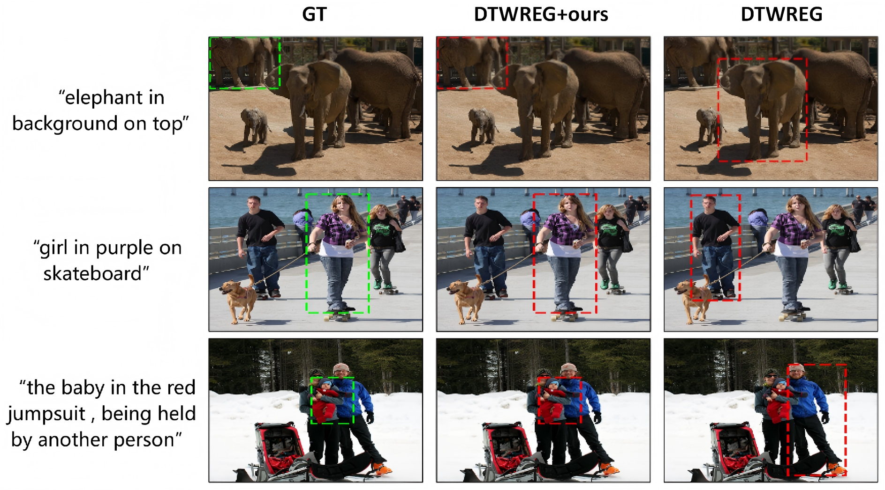

# Universal Relocalizer for Weakly Supervised Referring Expression Grounding

> A plug-and-play relocalization framework for weakly supervised referring expression grounding that improves object localization by refining proposal scores with category, color, and spatial cues.

## Authors

PANPAN ZHANG<sup>1</sup>, MENG LIU<sup>2*</sup>, XUEMENG SONG<sup>3*</sup>, DA CAO<sup>4</sup>, ZAN GAO<sup>5</sup>, LIQIANG NIE<sup>6</sup>

<sup>1</sup> Shandong University, Qingdao, China  
<sup>2</sup> Shandong Jianzhu University, Jinan, China   
<sup>3</sup> Southern University of Science and Technology, Shenzhen, China    
<sup>4</sup> Hunan University, Changsha, China  
<sup>5</sup> Qilu University of Technology, Jinan, China  
<sup>6</sup> Harbin Institute of Technology (Shenzhen), Shenzhen, China  

<sup>*</sup> Corresponding author


## Links

- **Paper**: [`Paper Link`](https://dl.acm.org/doi/10.1145/3656045)
- **Datset**: [`Dataset`](https://github.com/insomnia94/MAttNet)
- **Code Repository**: [`GitHub`](https://github.com/iLearn-Lab/<repo-name>)


---

## Table of Contents

- [Updates](#updates)
- [Introduction](#introduction)
- [Highlights](#highlights)
- [Method / Framework](#method--framework)
- [Project Structure](#project-structure)
- [Installation](#installation)
- [Checkpoints / Models](#checkpoints--models)
- [Dataset / Benchmark](#dataset--benchmark)
- [Usage](#usage)
- [Demo / Visualization](#demo--visualization)
- [TODO](#todo)
- [Citation](#citation)
- [Acknowledgement](#acknowledgement)
- [License](#license)

---

## Updates

- [04/2026] Initial release


---

## Introduction


We present **Universal Relocalizer**, a plug-and-play framework for **weakly supervised referring expression grounding**. It improves existing two-stage methods by refining proposal scores with category, color, and spatial relationship cues, leading to more accurate object localization without requiring region-level annotations. This repository provides the official implementation, along with training and evaluation code on standard benchmarks.

---

## Highlights

- 支持 `<referring expression grounding>`
- 提供 `<evaluation>` 脚本
- 提供 `<dataset>`
- 适合用于 `<论文复现 / 后续研究>`

---

## Framework

### Framework Figure

The overall architecture of **Universal Relocalizer** is illustrated below.  
Our framework is a plug-and-play relocalization module for weakly supervised referring expression grounding, which enhances existing two-stage methods by refining proposal scores with category, color, and spatial relationship information.

<p align="center">
  
</p>

<p align="center">
  <em>Figure 1. Overall framework of UR.</em>
</p>

### Main Components

- **Category Module**
- **Color Module**
- **Spatial Relationship Module**


---

## Project Structure

```text
.
├── assets/                # 图片、框架图、结果图、demo 图
├── configs/               # 配置文件
├── data/                  # 数据说明（不建议直接上传大数据本体）
├── scripts/               # 训练、推理、评测脚本
├── src/                   # 核心源码
├── README.md
├── requirements.txt
└── LICENSE
```

如果你的项目结构不同，请按实际情况修改。

---

## Installation

### 1. Clone the repository

```bash
git clone https://github.com/iLearn-Lab/TOMM2024-UR.git
cd TOMM2024-UR
```

### 2. Install dependencies

Please use **[reclip](https://github.com/allenai/reclip)** to set up the environment for **CLIP inference**.    
Please use **[DTWREG](https://github.com/insomnia94/DTWREG)** to set up the environment for **DTWREG enhancement**.

---


## Dataset

- **Dataset**: [`Dataset Link`](<https://github.com/lichengunc/MAttNet>)

数据组织方式如下

```text
$COCO_PATH
├── images
│   ├── mscoco
│   │   └── images
│   │       └── train2014
│   └── saiapr_tc12
├── refcoco
│   ├── instances.json
│   ├── refs(google).p
│   └── refs(unc).p
├── refcoco+
│   ├── instances.json
│   └── refs(unc).p
└── refcocog
    ├── instances.json
    └── refs(google).p

```

---

## Usage

### Generate the Triads for DTWREG
```bash
python ./tools/prepro_rel.py --dataset refcoco --splitBy unc
```

### Training
train DTWREG model
```bash
python ./tools/train.py --dataset refcoco --splitBy unc --exp_id 1
```

### Inference

CLIP inference: Use the CLIP model to extract category and color labels for the annotated bounding boxes.
```bash
python prepro_clip.py
```

DTWREG enhancement: Use the UR plugin to enhance the performance of DTWREG.

```bash
python ./eval.py --dataset refcoco --splitBy unc --split val --id 1
```

---

## Visualization


### Qualitative Comparison

<p align="center">
  
</p>

<p align="center">
  <em>Figure 1. Overall framework of UR.</em>
</p>
Qualitative comparison results between DTWREG and DTWREG with our method on RefCOCO, RefCOCO+, and
RefCOCOg datasets. The green boxes indicated the ground truth and the red boxes indicated the predictions. The figure was
best viewed in colors.

### Example Results

你可以插入结果图：

```markdown

```

或者放一个简单结果表：

| Setting | Result |
|---|---:|
| Baseline | xx.x |
| Ours | xx.x |

---

## TODO

- [ ] 完善文档
- [ ] 补充训练脚本说明
- [ ] 补充推理脚本说明
- [ ] 上传模型权重
- [ ] 上传结果图
- [ ] 发布 demo / project page

---

## Citation

```bibtex
@article{zhang2024universal,
  title={Universal relocalizer for weakly supervised referring expression grounding},
  author={Zhang, Panpan and Liu, Meng and Song, Xuemeng and Cao, Da and Gao, Zan and Nie, Liqiang},
  journal={ACM Transactions on Multimedia Computing, Communications and Applications},
  volume={20},
  number={7},
  pages={1--23},
  year={2024},
  publisher={ACM New York, NY}
}
```

---

## Acknowledgement


- This project benefits from the open-source implementation of [DTWREG](https://github.com/insomnia94/DTWREG).  
We sincerely thank the authors for making their code publicly available.

---

## License

This project is released under the Apache License 2.0.
